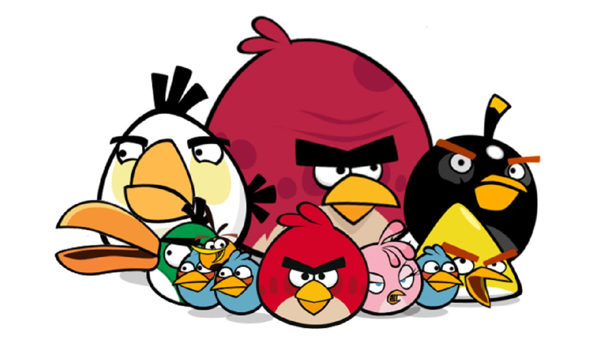

# Angry Birds
## Ejercicio integrador

**Un día normal, Red, Chuck y los Blues cuidaban su nido y sus huevos, mientras que por allí cerca pasaba una expedición conformada por el Rey Cerdo, y unos cerdos obreros buscando comida. Ven a lo lejos unos huevos y se les antojan. Entonces, Red y sus compañeros se distraen. Después de un rato se dan cuenta de que los huevos no están y ven a los cerdos cocinándolos. Así se inicia una guerra entre los Pájaros y los Cerdos.**

### 1. Cuidado con los pájaros

Todos los pájaros de la isla quieren atacar a los cerdos y para eso necesitan tener fuerza. Además, también pueden enojarse, lo cual los hace más fuertes. Esto en general implica solo duplicar su ira, salvo algunos casos puntuales que se mencionan. Los pájaros se comportan de la siguiente manera:

- Pájaros comunes: Para todos estos pájaros, la fuerza es el doble de su ira.
- Red: Su fuerza es su ira * 10 * la cantidad de veces que se enojo hasta el momento, ya que es rencoroso. 
- Bomb: Su fuerza es el doble de su ira, siempre que no supere su tope máximo de fuerza permitido, que actualmente es de 9000 pero podría cambiar. 
- Chuck: Su fuerza depende de la velocidad a la que esté corriendo en ese momento. Hasta los 80 kms por hora, es de 150, luego se le suma 5 * cada kilómetro que se pase de 80. Cuando se enoja, duplica su velocidad.
- Terence: Es otro pájaro rencoroso cuya fuerza depende de su ira, de la cantidad de veces que se enojo  y un multiplicador que puede cambiar. 
- Matilda: Su fuerza se calcula como el doble de su ira más la suma de la fuerza de todos sus huevos (cada huevo tiene la fuerza de su propio peso). Al enojarse, pone un huevo de 2 kilos. 

Se pide:

  1. Obtener la fuerza de un pájaro.
  2. Hacer enojar a un pájaro.
  3. Obtener a los pájaros fuertes de la isla, que son los que tienen una fuerza de más de 50.
  4. Obtener la fuerza de la isla, que es la suma de la fuerza de todos sus pájaros fuertes.

### 2. Una isla siniestra

En la isla Pájaro ocurren diferentes eventos que afectan la vida de nuestros pájaros favoritos. 
Entre ellos se encuentran: 
- Sesión de manejo de la ira con Matilda: Tranquiliza a todos los pájaros de la isla. Esto implica disminuir su ira en 5 unidades. A Chuck nada lo tranquiliza.
- Invasión de cerditos: Enoja a todos los pájaros una vez por cada 100 cerditos que invaden.
- Fiesta sorpresa: Hace enojar solamente a los homenajeados. ¿Qué pasa si no hay ninguno? 
- Serie de eventos desafortunados: Suceden varios eventos de los anteriores, secuencialmente.

Se pide:

  1. Hacer que suceda un evento en la isla pájaro.

### 3. Guerra porcina

Los cerditos se robaron todos los huevos de los pájaros y los tienen escondidos en la isla Cerdito. Para recuperarlos, los pájaros van a tener que pelear, y derribar todos los obstáculos que encuentren en su camino. Algunas cosas con las que pueden toparse son:

- Paredes de vidrio: Tienen una resistencia de 10 por el ancho de la pared.
- Paredes de madera: Tienen una resistencia de 25 por el ancho de la pared.
- Paredes de piedra: Tiene una resistencia de 50 por el ancho de la pared.
- Cerditos obreros: Tienen 50 de resistencia.
- Cerditos armados: Los cerditos con casco tienen tanta resistencia como 10 * la resistencia de su casco. Los cerditos con escudo resisten 10 * la resistencia de su escudo.

Cuando la isla Pájaro ataca a la isla Cerdito, lanza de a uno a todos sus habitantes, quienes impactan en el obstáculo más cercano. Si la fuerza del pájaro es mayor a la resistencia del obstáculo, lo derriba. Si no, el obstáculo se mantiene en pie.

Se pide:

  1. Saber si un pájaro puede derribar un obstáculo.
  2. Hacer que la isla Pájaro ataque a la isla Cerdito.
  3. Saber si se recuperaron los huevos, es decir, si la isla Cerdito quedó libre de obstáculos.

### 4. ¿Y si se abren los huevos?

Si quisiéramos incorporar nuevos pájaros a la isla, ¿qué cambios habría que hacer en la solución planteada? ¿Qué conceptos nos ayudan?
